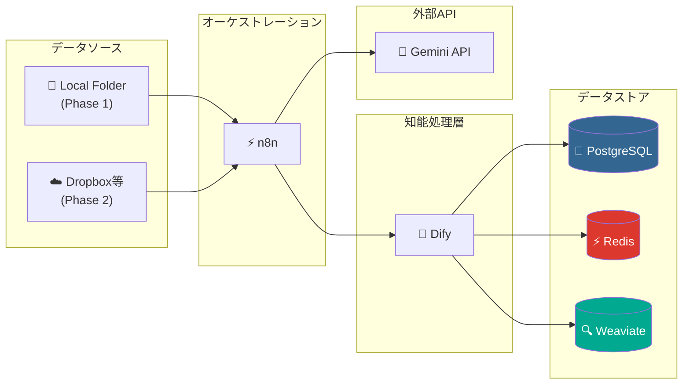
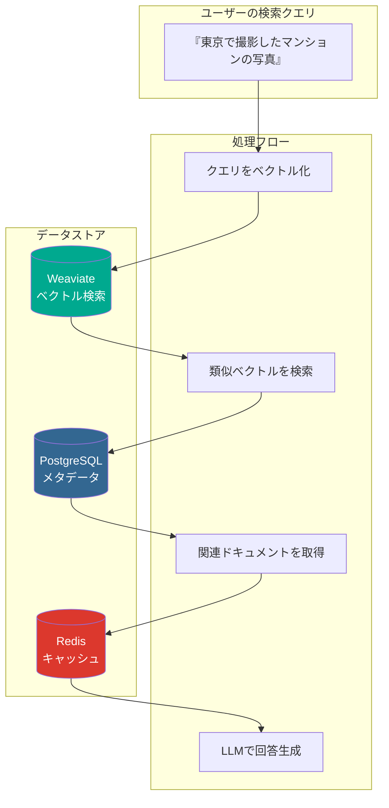
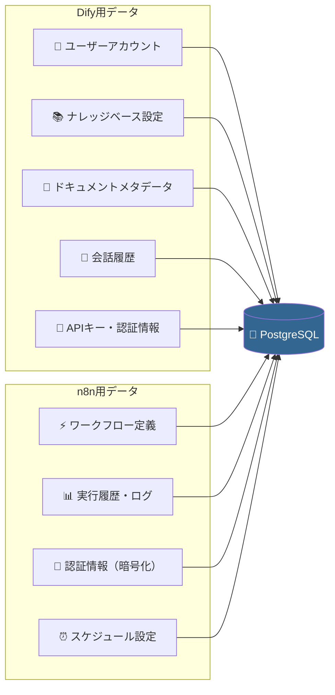
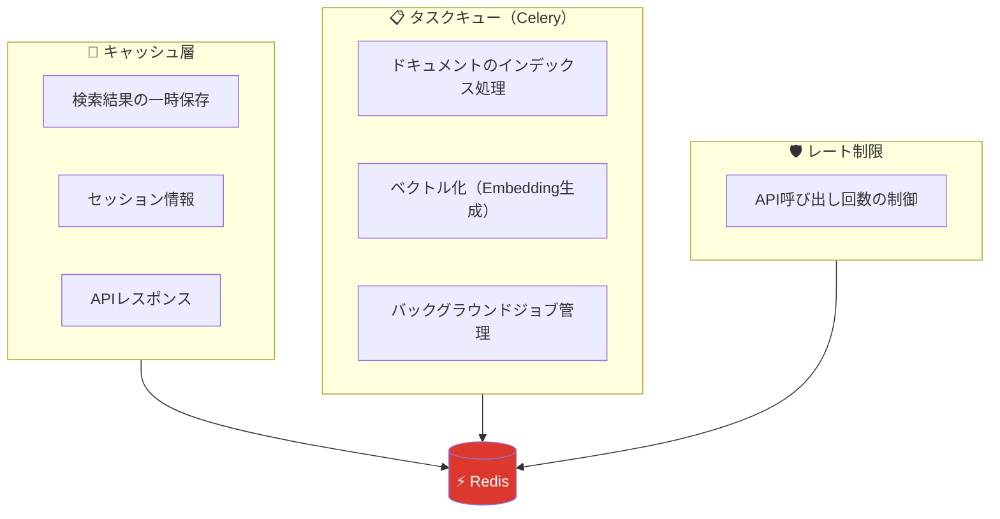
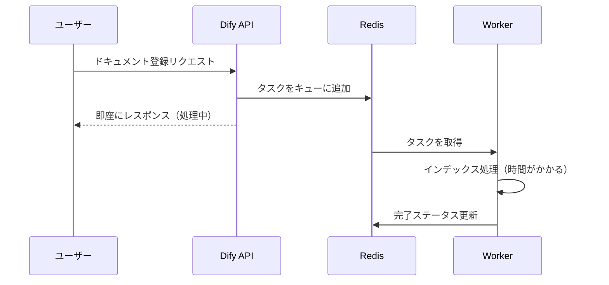
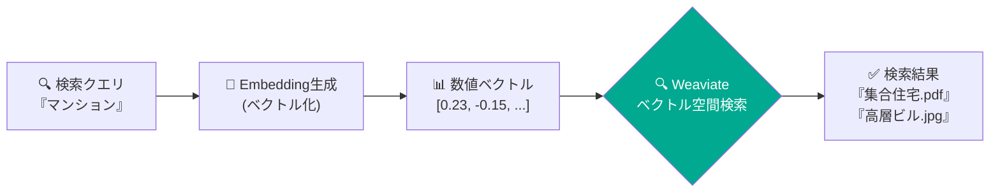
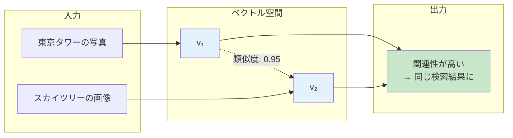
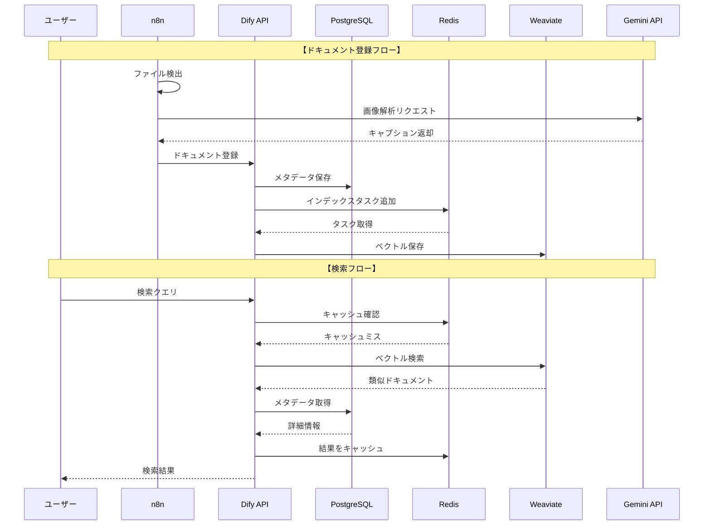
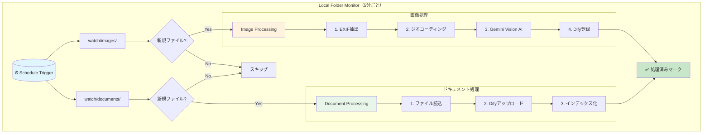
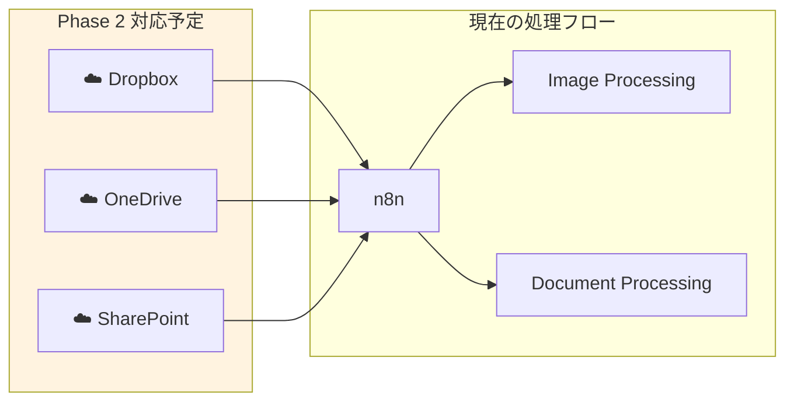

# DocuSearch_AI

非構造化データ（ドキュメント・画像）を構造化し、自然言語で検索可能にするRAG（Retrieval-Augmented Generation）プラットフォーム

## 開発フェーズ

| フェーズ | 対応データソース | ステータス |
|---------|-----------------|-----------|
| **Phase 1** | ローカルフォルダ監視 | 🚧 開発中 |
| **Phase 2** | Dropbox / OneDrive / SharePoint | 📋 計画中 |

## 概要

DocuSearch_AIは、以下の機能を提供します：

- **画像の自動解析**: EXIF情報（撮影日時・GPS座標）を抽出し、Vision AIで画像内容をテキスト化
- **ドキュメントのインデックス化**: PDF、Word、Excelなどを自動でチャンク分割・ベクトル化
- **セマンティック検索**: 「去年の東京での会議資料」「マンションの外観写真」など自然言語で検索
- **複数データソース対応**: ローカルフォルダを監視して自動処理（Phase 2でクラウドストレージ対応予定）

## アーキテクチャ



## インフラ構成の解説

### なぜこれらのサービスが必要か

DocuSearch_AIは、単純なファイル検索ではなく**セマンティック検索**（意味に基づく検索）を実現するため、複数の専門的なデータストアを組み合わせています。



### 各サービスの役割

| サービス | 役割 | なぜ必要か |
|---------|------|-----------|
| **PostgreSQL** | リレーショナルDB | メタデータ、ユーザー情報、設定の永続化 |
| **Redis** | インメモリDB | 高速キャッシュ、非同期タスクキュー |
| **Weaviate** | ベクトルDB | セマンティック検索（意味に基づく類似検索） |

---

### PostgreSQL（リレーショナルデータベース）

**用途**: 構造化データの永続的な保存

#### 1. ストレージ方式の比較

| 項目 | ファイルシステム | PostgreSQL |
|------|-----------------|------------|
| **データ構造** | フォルダ・ファイル形式 | **テーブル・リレーション形式** |
| **検索性能** | ファイル名のみ検索可能 | **複雑な条件での高速検索** |
| **整合性** | ❌ 同時アクセスで破損リスク | ✅ **ACID準拠で整合性保証** |
| **関連付け** | 手動で管理 | **外部キーで自動関連付け** |

#### 2. 保存されるデータ



#### 💡 なぜ PostgreSQL を採用するのか？

- **公式サポート**: Dify・n8n両方が公式にサポートしており、設定が容易
- **信頼性**: ACID準拠でトランザクションの整合性を保証
- **拡張性**: `pgvector`拡張でベクトル検索も可能（将来の機能追加に対応）
- **実績**: 世界中で使われている成熟したRDBMS

---

### Redis（インメモリデータベース）

**用途**: 高速キャッシュとタスクキュー

#### 1. 処理速度の比較

| 項目 | ディスクベースDB | Redis（インメモリ） |
|------|-----------------|-------------------|
| **読み取り速度** | 数ミリ秒〜数十ミリ秒 | **マイクロ秒〜1ミリ秒** |
| **書き込み速度** | ディスクI/O依存 | **メモリ速度で即座に完了** |
| **用途** | 永続的なデータ保存 | **一時データ・キャッシュ** |
| **スケール** | 垂直スケール中心 | **水平スケール容易** |

#### 2. Redisが担う3つの役割



#### 3. 非同期処理の流れ



#### 💡 なぜ Redis を採用するのか？

- **超高速**: インメモリ処理でミリ秒以下のレスポンス
- **Celery連携**: Difyのバックグラウンドタスク処理に必須
- **非同期処理**: 重いインデックス処理をユーザー待機なしで実行
- **シンプル**: Key-Value構造で扱いやすく、運用負荷が低い

---

### Weaviate（ベクトルデータベース）

**用途**: セマンティック検索（意味に基づく類似検索）

#### 1. 検索手法の比較

「文字」で探す従来の方式と、「意味」で探すWeaviateの方式の違いを整理します。

| 項目 | 従来のキーワード検索 | セマンティック検索（**Weaviate**） |
|------|---------------------|----------------------------------|
| **判定基準** | 文字列が完全・部分一致するか | **意味・概念が似ているか** |
| **検索例** | 「マンション」という文字を検索 | 「マンション」の**概念**を検索 |
| **ヒット対象** | 「マンション」を含む文書のみ | **「集合住宅」「アパート」「高層ビル」**も対象 |
| **精度** | ❌ 表記揺れや類義語に弱い | ✅ 文脈を理解し、曖昧な言葉でも届く |

#### 2. セマンティック検索の仕組み

データが数値（ベクトル）に変換され、空間上で「距離が近いもの」を探し出すフローです。



#### 3. ベクトル化の具体例

AI（Gemini等）によって、テキストは **1536次元** などの高次元ベクトルに変換されます。

| データ | ベクトル表現 |
|--------|-------------|
| 「東京タワーの写真」 | `v₁ = [0.82, -0.34, 0.56, 0.12, -0.78, ...]` |
| 「スカイツリーの画像」 | `v₂ = [0.79, -0.31, 0.52, 0.15, -0.75, ...]` |

> **結果**: `v₁` と `v₂` は数値の並びが非常に近いため、**コサイン類似度**が高いと判定され、関連結果として表示されます。



#### 💡 なぜ Weaviate を採用するのか？

- **Dify公式サポート**: 設定が容易で、RAG（検索拡張生成）との親和性が極めて高い
- **ハイブリッド検索**: 「キーワード検索」と「ベクトル検索」を組み合わせて、精度の高い絞り込みが可能
- **高速な検索エンジン**: **ANN（近似最近傍探索）**アルゴリズムを搭載し、数百万件のデータからも瞬時に類似データを特定
- **柔軟な運用**: オープンソースであり、Dockerでセルフホストが可能なためデータプライバシーを維持しやすい

---

### サービス間のデータフロー



## 必要条件

- Docker Desktop
- Gemini API Key（画像解析用）
- 8GB以上のRAM推奨

## クイックスタート

### 1. 環境設定

```bash
# リポジトリをクローン（または展開）
cd DocuSearch_AI

# 環境変数ファイルを作成
cp .env.example .env
```

`.env` ファイルを編集して、以下の値を設定：

```bash
# 必須: パスワードを安全な値に変更
POSTGRES_PASSWORD=your_secure_password
REDIS_PASSWORD=your_secure_password
DIFY_SECRET_KEY=your_32_character_secret_key_here
N8N_ENCRYPTION_KEY=your_24_character_key_here

# 必須: Gemini API Key
# https://aistudio.google.com/ で取得
GEMINI_API_KEY=your_gemini_api_key
```

### 2. サービス起動

```bash
# 全サービスを起動
docker compose up -d

# 起動状況を確認
docker compose ps

# ログを確認（問題がある場合）
docker compose logs -f
```

### 3. 初期設定

#### Dify設定

##### Step 1: データベース初期化（初回のみ）

初回起動時に「Internal Server Error」が表示される場合、データベースマイグレーションを実行：

```bash
# データベーステーブルを作成
docker compose exec dify-api flask db upgrade

# Difyサービスを再起動
docker compose restart dify-api dify-worker
```

##### Step 2: 管理者アカウント作成

1. http://localhost にアクセス
2. 自動的に `/install` にリダイレクトされる
3. 以下を入力して「Install」をクリック：

| 項目 | 入力内容 |
|------|---------|
| Email | 管理者メールアドレス |
| Name | 管理者名 |
| Password | 8文字以上のパスワード |

##### Step 3: モデル設定

1. ログイン後、右上のアイコン → **Settings**
2. **Model Provider** → **Gemini** を追加
3. `.env` に設定した `GEMINI_API_KEY` を入力

##### Step 4: ナレッジベース作成

1. 左メニュー → **Knowledge**
2. **Create Knowledge** をクリック
3. 名前: `DocuSearch`（任意）
4. 作成後、URLからナレッジベースIDを取得：
   ```
   http://localhost/knowledge/xxxxxxxx-xxxx-xxxx-xxxx-xxxxxxxxxxxx/...
                               ↑ この部分がDataset ID
   ```
5. `.env` の `DIFY_DATASET_ID` に設定

##### Step 5: API Key確認

n8nからDifyへの接続には、`.env` に設定済みの `DIFY_SECRET_KEY` を使用します。
追加のAPI Key取得は不要です。

##### Step 6: n8n設定

1. http://localhost:5678 にアクセス
2. 初回はオーナーアカウントを作成
3. ワークフローをインポート（以下の順番で実行）：
   - 左メニュー → **Workflows**
   - 右上の **...** → **Import from File**
   - `n8n/workflows/` フォルダ内のJSONファイルを順番にインポート：
     1. `document-processing.json` - ドキュメント処理
     2. `image-processing.json` - 画像処理
     3. `local-folder-monitor.json` - フォルダ監視（1,2を呼び出すため最後）
4. 認証情報（Credentials）を作成：
   - Overview → Credentials → Add Credential
   - **Header Auth** を選択
   - Name: `Authorization`
   - Value: `Bearer <DIFY_SECRET_KEYの値>`
   - 保存
5. 各ワークフローのプレースホルダーを置換：
   - **Document Processing**: 「Difyファイルアップロード」「ステータス確認」ノードのURLで `YOUR_DATASET_ID` を実際のDataset IDに置換
   - **Image Processing**: 「Gemini Vision API」ノードで `YOUR_GEMINI_API_KEY` を実際のAPIキーに、「Dify登録」ノードで `YOUR_DATASET_ID` を置換

##### Step 7: 動作確認

```bash
# watch/images フォルダに画像を配置
cp your_photo.jpg watch/images/

# watch/documents フォルダにドキュメントを配置
cp your_document.pdf watch/documents/
```

## サービス一覧

| サービス | ポート | 説明 |
|---------|--------|------|
| Dify Web | 3000 | RAGプラットフォームUI |
| Dify API | 5001 | REST API |
| n8n | 5678 | ワークフロー自動化 |
| Weaviate | 8080 | ベクトルデータベース |
| PostgreSQL | 5432 | メタデータDB |
| Redis | 6379 | キャッシュ |
| Nginx | 80 | リバースプロキシ |

## ディレクトリ構造

```
DocuSearch_AI/
├── docker-compose.yml      # サービス定義
├── .env.example            # 環境変数テンプレート
├── .env                    # 環境変数（要作成）
├── nginx/
│   └── nginx.conf          # リバースプロキシ設定
├── scripts/                # Pythonユーティリティ
│   ├── requirements.txt
│   ├── exif_extractor.py   # EXIF抽出
│   ├── geocoder.py         # GPS→住所変換
│   └── image_processor.py  # 画像処理統合
├── watch/                  # 監視フォルダ
│   ├── documents/          # ドキュメント投入
│   └── images/             # 画像投入
├── volumes/                # 永続化データ
│   ├── postgres_data/
│   ├── redis_data/
│   ├── weaviate_data/
│   ├── dify_data/
│   └── n8n_data/
└── 設計書/                  # 設計ドキュメント
```

## 画像処理パイプライン

画像ファイルは以下の処理を経てインデックス化されます：

```
画像ファイル
    │
    ▼
┌─────────────────────┐
│ 1. EXIF抽出         │
│   ・撮影日時        │
│   ・GPS座標         │
│   ・カメラ情報      │
└─────────────────────┘
    │
    ▼
┌─────────────────────┐
│ 2. ジオコーディング  │
│   GPS座標 → 住所    │
│   例: 35.68, 139.69 │
│   → 東京都港区...   │
└─────────────────────┘
    │
    ▼
┌─────────────────────┐
│ 3. Vision AI解析    │
│   Gemini 2.5 Flash  │
│   画像内容を日本語  │
│   テキストで記述    │
└─────────────────────┘
    │
    ▼
┌─────────────────────┐
│ 4. Difyインデックス │
│   メタデータ＋説明  │
│   をベクトル化      │
└─────────────────────┘
```

### インデックス化されるテキスト例

```
■ファイル名: IMG_20250115_143000.jpg
■撮影日時: 2025-01-15 14:30:00
■撮影場所: 芝公園, 港区, 東京都, 日本
■画像内容の説明:
東京タワーを背景にした都市風景の写真。手前には公園の緑地が広がり、
ビジネスマンが数人歩いている。晴天で明るい雰囲気。建物は主に
オフィスビルとマンションが混在している。
```

## Pythonスクリプトの使用方法

### EXIF抽出

```bash
cd scripts
pip install -r requirements.txt

# 画像からEXIF情報を抽出
python exif_extractor.py /path/to/image.jpg
```

出力例：
```json
{
  "datetime": "2025-01-15 14:30:00",
  "latitude": 35.6895,
  "longitude": 139.6917,
  "has_gps": true,
  "camera_make": "Apple",
  "camera_model": "iPhone 15 Pro"
}
```

### ジオコーディング

```bash
# GPS座標を住所に変換
python geocoder.py 35.6895 139.6917
```

出力例：
```json
{
  "formatted": "芝公園, 港区, 東京都, 日本",
  "country": "日本",
  "prefecture": "東京都",
  "city": "港区"
}
```

### 画像処理（統合）

```bash
# 画像を完全に処理（EXIF + ジオコーディング + Vision AI）
python image_processor.py /path/to/image.jpg
```

## n8nワークフロー設定

### ワークフローテンプレートのインポート

`n8n/workflows/` フォルダに3つのワークフローテンプレートが用意されています：

| ファイル | 説明 |
|---------|------|
| `local-folder-monitor.json` | メインワークフロー（5分ごとにフォルダ監視） |
| `image-processing.json` | 画像処理サブワークフロー |
| `document-processing.json` | ドキュメント処理サブワークフロー |

#### インポート手順

1. http://localhost:5678 でn8nにアクセス
2. 左メニュー → **Workflows** → **Import from File**
3. 以下の順でインポート：
   - `image-processing.json`（先にサブワークフロー）
   - `document-processing.json`
   - `local-folder-monitor.json`（最後にメイン）

#### 認証情報の設定

インポート後、以下の認証情報を設定：

1. **Dify API Key**
   - n8n → Settings → Credentials → Add Credential
   - Type: **Header Auth**
   - Name: `Dify API Key`
   - Header Name: `Authorization`
   - Header Value: `Bearer {your_dify_api_key}`

2. **環境変数の設定**
   - n8n → Settings → Variables
   - `GEMINI_API_KEY`: Gemini APIキー
   - `DIFY_DATASET_ID`: DifyナレッジベースID

#### ワークフローの有効化

1. 各ワークフローを開く
2. 右上の **Active** トグルをONにする
3. メインワークフローが5分ごとに実行開始

### 処理フロー



### 📋 Phase 2: クラウドストレージ連携（計画中）

Phase 2では、以下のクラウドストレージに対応予定：

| サービス | 対応予定 |
|---------|---------|
| Dropbox | ✅ |
| OneDrive | ✅ |
| SharePoint | ✅ |
| Google Drive | 検討中 |



## トラブルシューティング

### Difyで「Internal Server Error」が表示される

初回起動時にデータベーステーブルが作成されていない場合に発生します。

```bash
# データベースマイグレーションを実行
docker compose exec dify-api flask db upgrade

# サービスを再起動
docker compose restart dify-api dify-worker
```

### サービスが起動しない

```bash
# ログを確認
docker compose logs postgres
docker compose logs dify-api

# サービスを再起動
docker compose restart
```

### メモリ不足

Docker Desktopの設定でメモリを増やしてください（8GB以上推奨）

### ポートが使用中

`.env` または `docker-compose.yml` でポート番号を変更

### Difyにアクセスできない

```bash
# Difyサービスの状態確認
docker compose ps dify-api dify-web

# 依存サービスが起動しているか確認
docker compose ps postgres redis weaviate
```

## API キーの取得方法

### Gemini API Key

1. [Google AI Studio](https://aistudio.google.com/) にアクセス
2. Googleアカウントでログイン
3. 「Get API Key」をクリック
4. プロジェクトを選択してキーを生成

### Dropbox App（Phase 2）

> **Note**: Phase 2で実装予定。現時点では不要です。

1. [Dropbox Developers](https://www.dropbox.com/developers) にアクセス
2. 「Create app」をクリック
3. 「Scoped access」→「Full Dropbox」を選択
4. App key と App secret を取得

## ライセンス

MIT License

## 参考リンク

- [Dify ドキュメント](https://docs.dify.ai/)
- [n8n ドキュメント](https://docs.n8n.io/)
- [Weaviate ドキュメント](https://weaviate.io/developers/weaviate)
- [Gemini API ドキュメント](https://ai.google.dev/docs)
