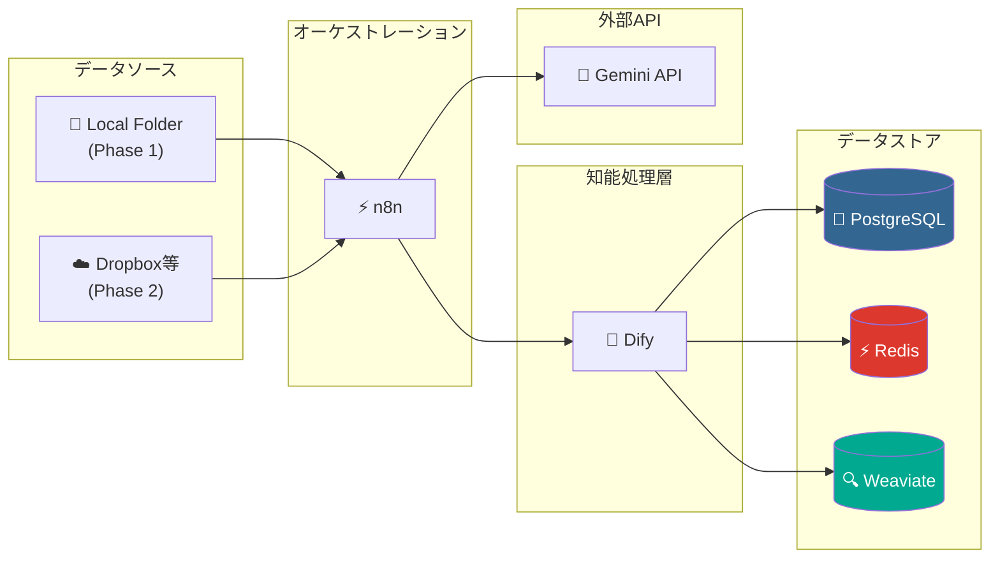
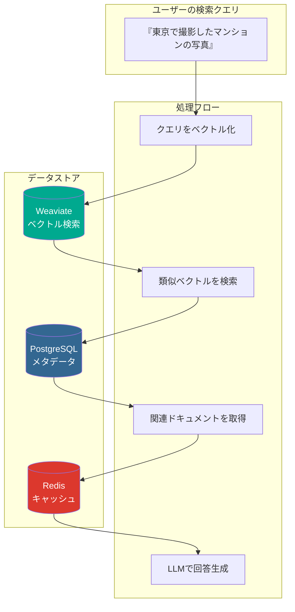
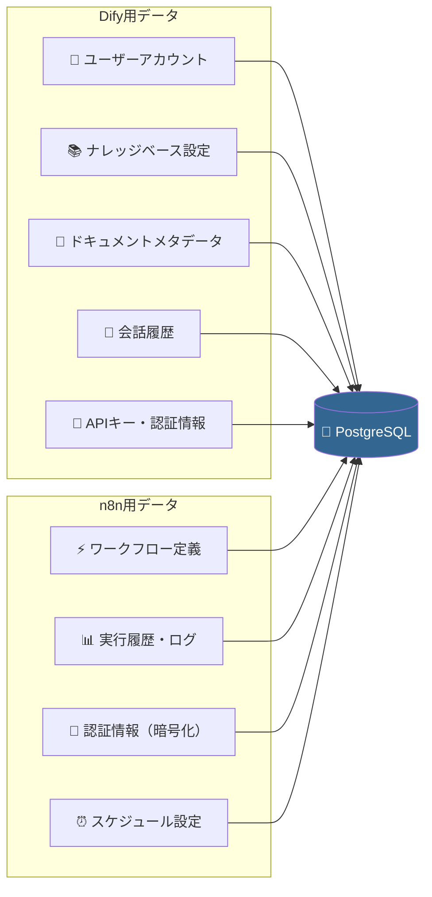
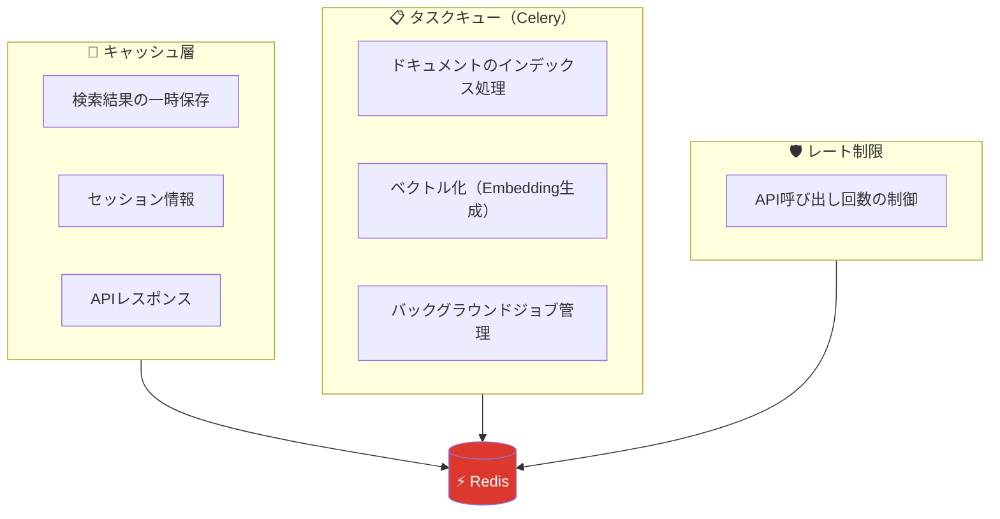
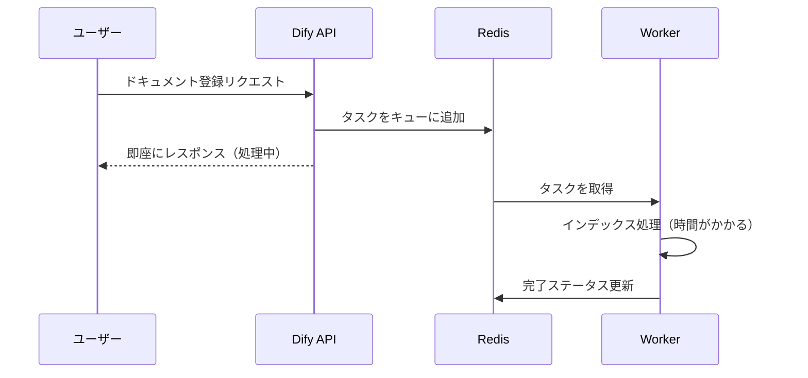
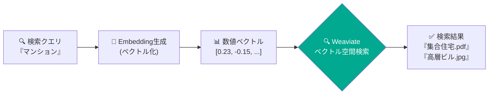
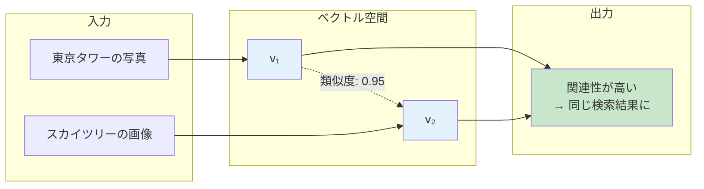
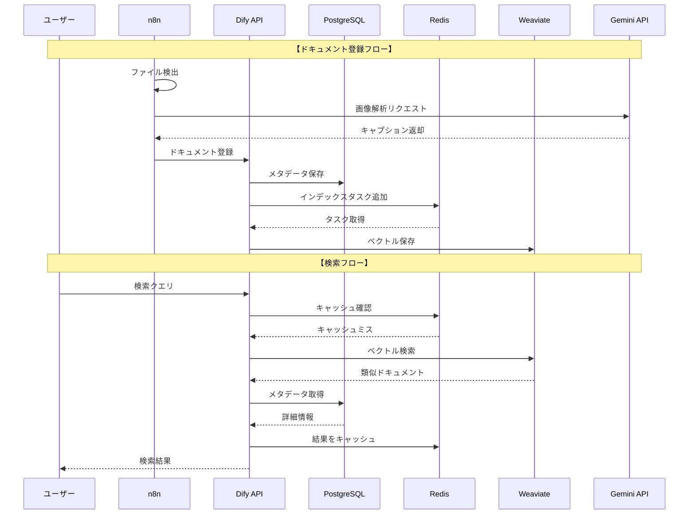
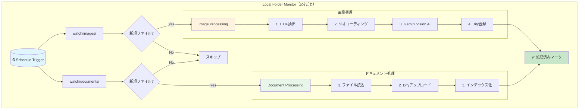
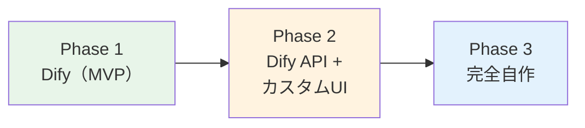

# アーキテクチャ解説

このドキュメントでは、DocuSearch_AIのシステムアーキテクチャと各コンポーネントの役割を解説します。

## システム概要



## なぜこれらのサービスが必要か

DocuSearch_AIは、単純なファイル検索ではなく**セマンティック検索**（意味に基づく検索）を実現するため、複数の専門的なデータストアを組み合わせています。



## 各サービスの役割

| サービス | 役割 | なぜ必要か |
| -------- | ---- | ---------- |
| **PostgreSQL** | リレーショナルDB | メタデータ、ユーザー情報、設定の永続化 |
| **Redis** | インメモリDB | 高速キャッシュ、非同期タスクキュー |
| **Weaviate** | ベクトルDB | セマンティック検索（意味に基づく類似検索） |

---

## PostgreSQL（リレーショナルデータベース）

**用途**: 構造化データの永続的な保存

### ストレージ方式の比較

| 項目 | ファイルシステム | PostgreSQL |
| ---- | --------------- | ---------- |
| **データ構造** | フォルダ・ファイル形式 | **テーブル・リレーション形式** |
| **検索性能** | ファイル名のみ検索可能 | **複雑な条件での高速検索** |
| **整合性** | 同時アクセスで破損リスク | **ACID準拠で整合性保証** |
| **関連付け** | 手動で管理 | **外部キーで自動関連付け** |

### 保存されるデータ



### なぜ PostgreSQL を採用するのか

- **公式サポート**: Dify・n8n両方が公式にサポートしており、設定が容易
- **信頼性**: ACID準拠でトランザクションの整合性を保証
- **拡張性**: `pgvector`拡張でベクトル検索も可能（将来の機能追加に対応）
- **実績**: 世界中で使われている成熟したRDBMS

---

## Redis（インメモリデータベース）

**用途**: 高速キャッシュとタスクキュー

### 処理速度の比較

| 項目 | ディスクベースDB | Redis（インメモリ） |
| ---- | --------------- | ------------------- |
| **読み取り速度** | 数ミリ秒〜数十ミリ秒 | **マイクロ秒〜1ミリ秒** |
| **書き込み速度** | ディスクI/O依存 | **メモリ速度で即座に完了** |
| **用途** | 永続的なデータ保存 | **一時データ・キャッシュ** |
| **スケール** | 垂直スケール中心 | **水平スケール容易** |

### Redisが担う3つの役割



### 非同期処理の流れ



### なぜ Redis を採用するのか

- **超高速**: インメモリ処理でミリ秒以下のレスポンス
- **Celery連携**: Difyのバックグラウンドタスク処理に必須
- **非同期処理**: 重いインデックス処理をユーザー待機なしで実行
- **シンプル**: Key-Value構造で扱いやすく、運用負荷が低い

---

## Weaviate（ベクトルデータベース）

**用途**: セマンティック検索（意味に基づく類似検索）

### 検索手法の比較

「文字」で探す従来の方式と、「意味」で探すWeaviateの方式の違いを整理します。

| 項目 | 従来のキーワード検索 | セマンティック検索（**Weaviate**） |
| ---- | ------------------- | --------------------------------- |
| **判定基準** | 文字列が完全・部分一致するか | **意味・概念が似ているか** |
| **検索例** | 「マンション」という文字を検索 | 「マンション」の**概念**を検索 |
| **ヒット対象** | 「マンション」を含む文書のみ | **「集合住宅」「アパート」「高層ビル」**も対象 |
| **精度** | 表記揺れや類義語に弱い | 文脈を理解し、曖昧な言葉でも届く |

### セマンティック検索の仕組み

データが数値（ベクトル）に変換され、空間上で「距離が近いもの」を探し出すフローです。



### ベクトル化の具体例

AI（Gemini等）によって、テキストは **1536次元** などの高次元ベクトルに変換されます。

| データ | ベクトル表現 |
| ------ | ------------ |
| 「東京タワーの写真」 | `v₁ = [0.82, -0.34, 0.56, 0.12, -0.78, ...]` |
| 「スカイツリーの画像」 | `v₂ = [0.79, -0.31, 0.52, 0.15, -0.75, ...]` |

> **結果**: `v₁` と `v₂` は数値の並びが非常に近いため、**コサイン類似度**が高いと判定され、関連結果として表示されます。



### なぜ Weaviate を採用するのか

- **Dify公式サポート**: 設定が容易で、RAG（検索拡張生成）との親和性が極めて高い
- **ハイブリッド検索**: 「キーワード検索」と「ベクトル検索」を組み合わせて、精度の高い絞り込みが可能
- **高速な検索エンジン**: **ANN（近似最近傍探索）**アルゴリズムを搭載し、数百万件のデータからも瞬時に類似データを特定
- **柔軟な運用**: オープンソースであり、Dockerでセルフホストが可能なためデータプライバシーを維持しやすい

---

## サービス間のデータフロー



---

## 画像処理パイプライン

画像ファイルは以下の処理を経てインデックス化されます：

```
画像ファイル
    │
    ▼
┌─────────────────────┐
│ 1. EXIF抽出         │
│   ・撮影日時        │
│   ・GPS座標         │
│   ・カメラ情報      │
└─────────────────────┘
    │
    ▼
┌─────────────────────┐
│ 2. ジオコーディング  │
│   GPS座標 → 住所    │
│   例: 35.68, 139.69 │
│   → 東京都港区...   │
└─────────────────────┘
    │
    ▼
┌─────────────────────┐
│ 3. Vision AI解析    │
│   Gemini 2.5 Flash  │
│   画像内容を日本語  │
│   テキストで記述    │
└─────────────────────┘
    │
    ▼
┌─────────────────────┐
│ 4. Difyインデックス │
│   メタデータ＋説明  │
│   をベクトル化      │
└─────────────────────┘
```

### インデックス化されるテキスト例

```text
■ファイル名: IMG_20250115_143000.jpg
■撮影日時: 2025-01-15 14:30:00
■撮影場所: 芝公園, 港区, 東京都, 日本
■画像内容の説明:
東京タワーを背景にした都市風景の写真。手前には公園の緑地が広がり、
ビジネスマンが数人歩いている。晴天で明るい雰囲気。建物は主に
オフィスビルとマンションが混在している。
```

---

## n8n ワークフロー処理フロー



---

## 商用運用に向けた検討事項

### 現在のアーキテクチャ（MVP / PoC向け）

現在のDifyベースの構成は、以下のユースケースに適しています：

- **MVP（Minimum Viable Product）検証**
- **PoC（Proof of Concept）実施**
- **小〜中規模運用**（〜2000件程度のドキュメント）
- **カスタムUI不要**の場合

### 商用運用での課題

Difyの標準UIでは以下の機能が**実装困難**です：

| 機能 | Dify | 自作システム |
| ---- | ---- | ------------ |
| フォルダツリー表示・ブラウジング | × 不可 | ◎ 可能 |
| フォルダパスでのフィルタ検索 | △ 限定的 | ◎ 自由に実装 |
| カスタムメタデータUI | × 不可 | ◎ 可能 |
| 権限管理（フォルダ単位） | × 不可 | ◎ 可能 |
| 企業ブランディング | △ 限定的 | ◎ 完全カスタム |

### アーキテクチャ選択肢の比較

#### オプションA: Dify（現状維持）

```text
[Dify Web UI] → [Dify API] → [Weaviate]
```

| 観点 | 評価 |
| ---- | ---- |
| 開発速度 | ◎ 早い（ノーコード/ローコード） |
| 運用コスト | ◎ 低い（Difyが管理） |
| カスタムUI | × 不可 |
| 機能拡張性 | △ Difyの機能範囲内 |
| 適用規模 | 〜2000件程度 |

**推奨ケース**: MVP、PoC、社内ツール、小規模運用

#### オプションB: Dify API + カスタムフロントエンド

```text
[React フロントエンド] → [Dify API] → [Weaviate]
     ├── フォルダツリー
     ├── フィルタUI
     └── 検索結果表示
```

| 観点 | 評価 |
| ---- | ---- |
| 開発速度 | ○ 中程度（フロントのみ開発） |
| 運用コスト | ○ 中程度 |
| カスタムUI | ◎ 自由 |
| 機能拡張性 | ○ UI側は自由、RAG側はDify依存 |
| 適用規模 | 〜5000件程度 |

**推奨ケース**: カスタムUIが必要だがRAG実装は避けたい場合

#### オプションC: 完全自作（Python + React）

```text
[React フロントエンド]
         ↓
[FastAPI バックエンド]
     ├── LangChain / LlamaIndex（RAG）
     ├── Gemini API（Embedding + LLM）
     └── Weaviate / PostgreSQL + pgvector
```

| 観点 | 評価 |
| ---- | ---- |
| 開発速度 | △ 時間がかかる |
| 運用コスト | △ 高い（全て自己管理） |
| カスタムUI | ◎ 完全に自由 |
| 機能拡張性 | ◎ 制限なし |
| 適用規模 | 無制限（設計次第） |

**推奨ケース**: 大規模商用運用、独自機能が多数必要な場合

### 移行パス



1. **Phase 1（現在）**: Difyで機能検証・ユーザーフィードバック収集
2. **Phase 2**: 要件が固まったらカスタムフロントエンド開発
3. **Phase 3**: 大規模化・独自機能追加時に完全自作へ移行

### 自作システムの技術スタック案

| レイヤー | 技術選択肢 |
| -------- | ---------- |
| フロントエンド | React / Next.js / Vue.js |
| バックエンド | FastAPI (Python) / NestJS (Node.js) |
| RAGフレームワーク | LangChain / LlamaIndex |
| ベクトルDB | Weaviate / PostgreSQL + pgvector / Chroma |
| LLM | Gemini API / OpenAI API / ローカルLLM |
| Embedding | gemini-embedding-001 / text-embedding-3-small |

### 判断基準

| 条件 | 推奨アーキテクチャ |
| ---- | ------------------ |
| とにかく早くリリースしたい | **Dify（オプションA）** |
| カスタムUIは必要だが、RAG実装は避けたい | **Dify API + カスタムUI（オプションB）** |
| 大規模運用・独自機能が多数必要 | **完全自作（オプションC）** |
| フォルダブラウジング機能が必須 | **オプションB または C** |
| データ件数が1万件を超える見込み | **オプションC推奨** |

---

## 次のステップ

- [開発戦略と意思決定の根拠](./DEVELOPMENT_STRATEGY.md) - MVP選択理由、AI支援開発、移行判断

- [環境構築手順](./SETUP.md)
- [n8nワークフロー設定](./N8N_WORKFLOW_SETUP.md)
- [トラブルシューティング](./TROUBLESHOOTING.md)
