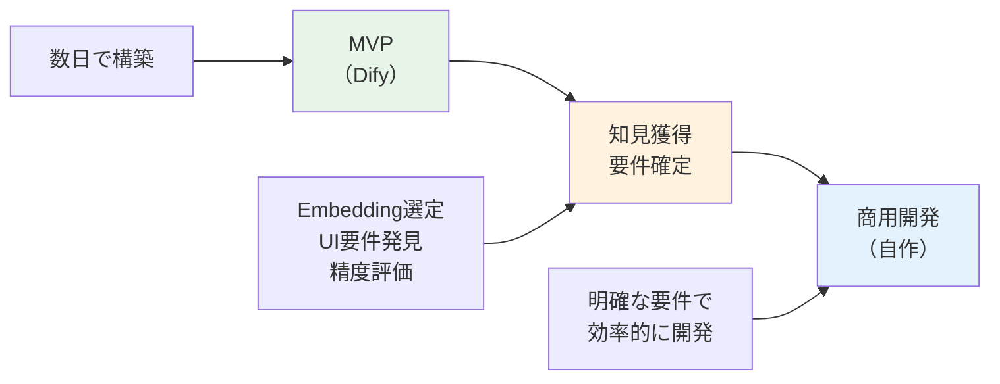
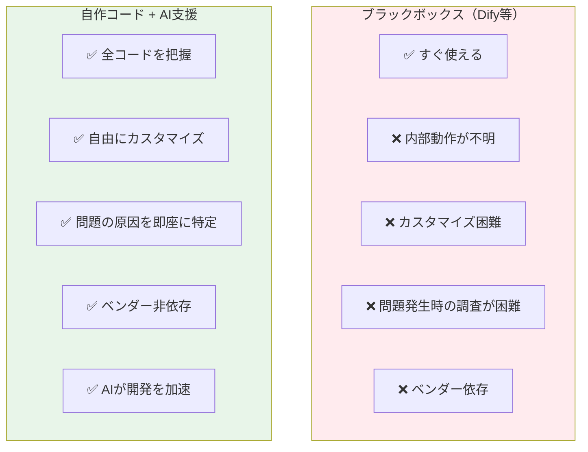
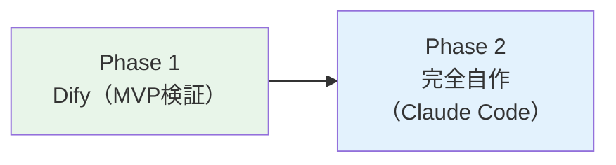
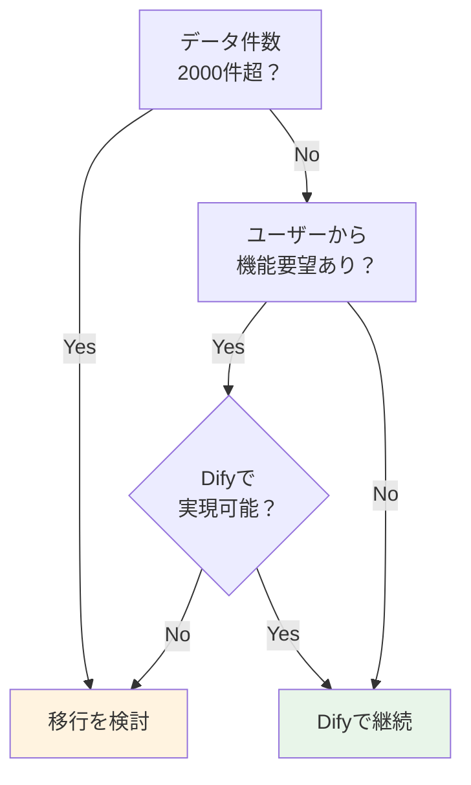

# 開発戦略と意思決定の根拠

このドキュメントでは、DocuSearch_AIプロジェクトにおける開発アプローチの選択理由と、今後の方針について解説します。

---

## 目次

1. [なぜMVPでDify/n8nを使うのが正解か](#なぜmvpでdifyn8nを使うのが正解か)
2. [MVPで得られた知見](#mvpで得られた知見)
3. [ノーコードの本質](#ノーコードの本質配管工事から水源の選定へ)
4. [AI支援開発（Claude Code）による戦略変化](#ai支援開発claude-codeによる開発戦略の変化)
5. [Difyからの卒業タイミング](#difyからの卒業タイミング)

---

## なぜMVPでDify/n8nを使うのが正解か

### よくある誤解

> 「AI支援開発で自作が速いなら、最初からDifyを使わずに自作すればよかったのでは？」

**この考えは間違いです。** MVPフェーズでDify/n8nを使ったのは正しい判断でした。

### MVPの目的は「検証」であり「完成品」ではない

| フェーズ | 目的 | 最適なアプローチ |
| -------- | ---- | ---------------- |
| MVP | 仮説検証・要件発見 | **既存ツール（Dify）で素早く動かす** |
| 商用開発 | 完成品の構築 | 自作（要件が明確だから） |

### 最初から自作した場合のリスク

```text
【最初から自作の場合】
要件が曖昧なまま開発開始
    ↓
RAG実装に数週間
    ↓
動かしてみる
    ↓
「検索精度が悪い」「UIが使いにくい」
    ↓
大幅な修正・作り直し
    ↓
時間とコストの無駄
```

### 身近な例えで理解する

#### 例1: BigQueryでSQL確認してからアプリ実装

```text
【いきなりアプリに組み込む】
SELECT文を書く → アプリに組み込む → ビルド → 動かす
→ 「結果が違う」→ どこが悪い？アプリ？SQL？
→ 切り分けに時間がかかる

【BigQuery UIで先に確認】
BigQuery UIでSELECT実行 → 結果を目視 → 「これで正しい」を確認
→ 確信を持ってアプリに組み込む
→ 問題があってもSQLは正しいと分かっている
```

#### 例2: Excelで集計ロジック確認してからシステム化

```text
【いきなりシステム開発】
要件定義 → DB設計 → 画面開発 → 集計ロジック実装
→ 「この集計項目も欲しかった」「計算式が違う」
→ 大幅な改修

【Excelで先に検証】
Excelで集計表を作成 → ユーザーに見せる → 「これでOK」を確認
→ 確定した仕様でシステム開発
→ 手戻りなし
```

#### 例3: curlでAPI確認してから連携実装

```text
【いきなりAPI連携コード実装】
HTTPクライアント実装 → 認証処理 → パース処理 → 動かす
→ 「レスポンスの形式が想定と違う」
→ どこが悪い？認証？URL？パース？

【curlで先に確認】
curl でAPIを叩く → レスポンスを目視確認 → 「この形式で返ってくる」
→ 確信を持って実装
→ 問題があってもAPI仕様は分かっている
```

#### Dify/n8nも同じ

```text
【RAGをいきなり自作】
Embedding実装 → 検索実装 → UI実装 → 動かす
→ 「検索精度が悪い」→ どこが悪い？Embedding？検索ロジック？UI？
→ 切り分けに時間がかかる

【Dify/n8nで先に確認】
Difyで検索実行 → 結果を目視 → 「このEmbeddingモデルが正しい」を確認
→ 確信を持って自作に取り組める
→ 問題があっても技術選定は正しいと分かっている
```

#### 共通点

> **「既に作られている環境」で部品の動作確認を先に行い、本番実装時の手戻りを減らす**

| ツール | 「既に作られている部分」 | 「早く確認できること」 |
| ------ | ------------------------ | ---------------------- |
| BigQuery | SQLエンジン、UI | クエリ結果の正しさ |
| Excel | 計算エンジン、表示 | 集計ロジックの正しさ |
| curl | HTTPクライアント | APIレスポンスの形式 |
| Dify/n8n | RAGエンジン、UI | 検索精度、Embedding選定 |

### 正しい開発フロー



### 比較：MVPありvs MVPなし

| 観点 | MVPなし（最初から自作） | MVPあり（Dify → 自作） |
| ---- | ----------------------- | ---------------------- |
| 要件の明確さ | △ 曖昧なまま開発 | ◎ 動くもので確認済み |
| 手戻りリスク | 高い | **低い** |
| 総開発期間 | 長い（手戻り込み） | **短い** |
| 技術選定の確実性 | △ 推測ベース | ◎ 実証済み |

---

## MVPで得られた知見

### 具体的な知見

今回のMVPで以下の重要な知見が得られました。これらは**実際に動かさないと分からなかった**ことです：

| 知見 | 詳細 | 自作で最初から気づけたか |
| ---- | ---- | ------------------------ |
| Embeddingモデルの重要性 | `gemini-embedding-001`が日本語検索に有効 | △ 試行錯誤に時間がかかった |
| 検索方式の理解 | ベクトル検索で十分、Rerankerは大規模時のみ | × 実際の精度を見ないと判断不可 |
| UIの課題発見 | フォルダブラウジング機能が必要 | × ユーザーに見せないと分からない |
| データ量と精度の関係 | 2000件程度ならベクトル検索で十分 | × 実データで検証しないと不明 |

### MVPでの変更コストの優位性

Difyを使ったMVPでは、試行錯誤のコストが**劇的に低い**ため、素早く正解にたどり着けます：

| 変更項目 | Difyでの変更 | 自作コードでの変更 |
| -------- | ------------ | ------------------ |
| **Embeddingモデル変更** | プルダウンで選択（10秒） | ライブラリ入替・環境変数・テスト（数時間） |
| **プロンプト微調整** | 画面上で書き換えて保存（30秒） | コード修正・デプロイ・反映確認（30分〜） |
| **検索方式切替** | スイッチを切り替える（5秒） | 関数書き換え・ロジック検証（半日〜） |
| **チャンクサイズ調整** | 数値入力して保存（10秒） | パラメータ変更・再インデックス（1時間〜） |

> **重要な気づき:**
> 「Difyは**『正解がわからない時期』の試行錯誤コストをほぼゼロにするサンドボックス**です。正解がわかってからコードを書くのが、結局一番早いのです。」

### 「やらなくていいこと」の発見価値

MVPで得られた知見には、**「不要と判明したもの」**も含まれます。これは自作開発でのオーバーエンジニアリングを防ぎます：

| 当初の想定 | MVP検証の結果 | 節約できた工数 |
| ---------- | ------------- | -------------- |
| Reranker実装が必要 | 2000件以下ならベクトル検索で十分 | **1〜2週間** |
| ハイブリッド検索が必要 | gemini-embedding-001で精度十分 | **1週間** |
| 複雑なチャンク戦略 | デフォルト設定で問題なし | **数日** |

> **チームへのメッセージ:**
> 「Difyで『やらなくていいこと』を切り捨てられただけで、今回のMVPには**数百万円分の価値**がありました。」

### Dify設定 = 「動く仕様書」

今、私たちの手元にはDifyで検証済みの**「動く仕様書」**があります：

```text
【Difyで確定した仕様】
├── Embeddingモデル: gemini-embedding-001
├── 検索方式: ベクトル検索
├── チャンクサイズ: デフォルト
├── 検索結果数: 上位5件
└── プロンプト: 検証済みテンプレート
```

これから行う自作開発は、**この仕様をコードに写経するだけ**の作業になります：

| 観点 | 仕様なし（推測ベース） | 仕様あり（Dify検証済み） |
| ---- | ---------------------- | ------------------------ |
| 設計の迷い | 多い | **ほぼなし** |
| 実装の手戻り | 頻発 | **最小限** |
| テスト基準 | 曖昧 | **Difyの動作が正解** |
| 開発速度 | 遅い | **高速** |

> **重要:**
> 「Difyの設定画面のスクリーンショットが、そのまま実装仕様書になります。」

---

## ノーコードの本質：「配管工事」から「水源の選定」へ

### 誤解：ノーコード = 楽ができる・何もしなくていい

これは間違いです。実際には：

> **低付加価値な作業（配管工事）を捨てて、高付加価値な作業（設計と検証）に注力している**

### 「配管工事」とは何か

プログラミングにおける「コードを書く作業」の多くは、APIを叩く、エラーハンドリングをする、データを整形してDBに投げるといった**「データの配管工事」**です：

| アプローチ | 時間の使い方 |
| ---------- | ------------ |
| **自作（コード）** | `requests`でAPI呼出、トークン監視、ベクトル次元数合わせ...配管に時間を取られる |
| **ノーコード（Dify）** | 配管は完成済み。**「どのモデル（水源）が最適か？」**という戦略的判断に集中 |

### 「書ける人が、あえて書かない」選択

現在の状況は、**「Pythonが書けるからこそ、あえて書かない選択をしている」**状態です：

| 従来の開発（コード中心） | 現代のAI開発（Dify等活用） |
| ------------------------ | -------------------------- |
| **注力点:** 文法、ライブラリの仕様、デバッグ | **注力点:** モデルの特性理解、データ品質、UX |
| **成果物:** 動くプログラム | **成果物:** ユーザーの課題を解決する「精度」 |

### 具体例：今回のMVPで行った「高付加価値作業」

| 作業内容 | 付加価値 |
| -------- | -------- |
| `embedding-001` → `gemini-embedding-001` への切替判断 | **検索精度を決定する最重要判断** |
| 日本語検索の精度評価 | **ユーザー体験を直接左右** |
| Reranker必要性の検証 | **不要な複雑さを排除** |
| 無関係な検索結果の原因特定 | **Embeddingモデル選定の重要性を実証** |

これらはすべて、**配管工事（コード実装）をスキップしたからこそ、注力できた作業**です。

### 結論：ノーコードは「思考を止めないため」のツール

ノーコードを使う最大の理由：

> **「どう実装するか（How）」に脳のメモリを奪われず、「何を作るか（What）」「精度は十分か（Why）」に全神経を集中させるため**

```text
【コード中心の思考】
「この関数どう書く？」「このライブラリのバグ？」「型が合わない...」
→ 本質的な課題から意識が逸れる

【ノーコード活用の思考】
「このモデルで精度出る？」「ユーザーはこの結果で満足する？」
→ プロダクトの本質に集中
```

> **「コードを書く代わりに、結果に責任を持つための検証に時間を使っている」**

---

## AI支援開発（Claude Code）による開発戦略の変化

### 従来の開発 vs AI支援開発

従来、「自作システム」は開発コストが最大のデメリットでした。しかし、**Claude Code等のAIコーディング支援ツール**を活用することで、この前提が大きく変わります。

| 観点 | 従来の開発 | AI支援開発（Claude Code） |
| ---- | ---------- | ------------------------- |
| 初期開発 | 数週間〜数ヶ月 | **数日〜1週間** |
| 機能追加 | 要件定義→設計→実装→テスト | **対話しながら即座に実装** |
| デバッグ | ログ解析、手動調査 | **コード全体を理解した上で原因特定** |
| 学習コスト | ドキュメント読解、試行錯誤 | **質問しながら理解** |
| ボイラープレート | 手動作成 or テンプレート | **数分で生成** |

### ブラックボックス vs 自作コードの比較



### AI支援開発の具体的なメリット

#### 1. 開発速度の劇的な向上

| タスク | 従来 | Claude Code活用 |
| ------ | ---- | --------------- |
| FastAPI + React プロジェクト構築 | 1-2日 | **数時間** |
| LangChain RAG実装 | 3-5日 | **1日** |
| バグ修正 | 数時間〜1日 | **数分〜数時間** |
| 新機能追加 | 数日 | **数時間** |

#### 2. コードの透明性

```text
【ブラックボックス（Dify）の場合】
エラー発生 → ログを見る → 内部実装が不明 → 推測でデバッグ → 時間がかかる

【自作 + AI支援の場合】
エラー発生 → Claude Codeに質問 → コード全体を理解した回答 → 即座に修正
```

#### 3. 柔軟な機能拡張

自作システムでは、以下のような機能を**自由に追加**できます：

- フォルダツリー表示・ブラウジング
- 企業独自の権限管理
- カスタムメタデータフィルタ
- 独自のUI/UXデザイン
- 外部システムとの連携

### 推奨する移行パス（AI支援開発前提）

従来の段階的移行ではなく、**Phase 2（Dify API + カスタムUI）をスキップ**することを推奨します。



**理由:**

- Dify APIに依存した中間実装を作ると、後で全て書き直しになる
- Claude Codeを使えば、最初から自作しても開発速度は十分早い
- コードベースを最初から把握できるため、長期的な保守が楽

### チームへの提言

> **「AIツールを使うなら、ブラックボックスより自作コードの方が速い」**

従来は「自作=時間がかかる」でしたが、AI支援開発では：

1. **ブラックボックスの制約に悩む時間** > **AIで自作する時間**
2. **問題発生時のデバッグ** → 自作コードの方が圧倒的に早い
3. **機能追加・変更** → 自作コードなら即座に対応可能

### 結論

| シナリオ | 推奨 |
| -------- | ---- |
| MVP・PoC（機能検証） | Dify（素早く検証） |
| 商用運用（カスタム機能必要） | **自作 + Claude Code** |
| 長期的な保守・拡張 | **自作 + Claude Code** |

---

## Difyからの卒業タイミング

以下のいずれかに該当した場合、自作システムへの移行を検討すべきです。

### 🔴 今すぐ移行を検討

| サイン | 詳細 |
| ------ | ---- |
| **ユーザーからフォルダ機能の要望** | 「フォルダで絞り込みたい」「階層で見たい」 |
| **権限管理の要件発生** | 「部署ごとに見えるデータを分けたい」 |
| **カスタムUIの必要性** | 企業ロゴ、独自デザイン、既存システムへの埋め込み |
| **Difyの機能で実現不可能な要件** | 外部API連携、複雑なフィルタ条件など |

### 🟡 近い将来の移行を計画

| サイン | 詳細 |
| ------ | ---- |
| **データ件数が2000件を超えそう** | パフォーマンス・検索精度の懸念 |
| **複数クライアントへの展開** | マルチテナント対応の必要性 |
| **SLA（稼働率保証）の要件** | Difyのバージョンアップリスク |

### 🟢 Difyで継続してよいケース

| 条件 | 詳細 |
| ---- | ---- |
| **社内ツールとして利用** | 機能要望が少ない、UIカスタム不要 |
| **データ件数が500件未満** | 小規模運用 |
| **PoC・検証フェーズ継続中** | まだ要件が固まっていない |

### 移行判断フローチャート



---

## チームへの説明ポイント

> **「ブラックボックスでMVP検証 → 自作で商用開発」が最も効率的**

1. **MVPフェーズ**: Difyで素早く動くものを作り、仮説を検証
2. **知見獲得**: Embeddingモデル、検索方式、UI要件を実証
3. **商用開発**: 明確な要件をもとにClaude Codeで効率的に自作

**「最初から自作すればよかった」は結果論です。** MVPで検証したからこそ、今の要件が明確になりました。

---

## 関連ドキュメント

- [アーキテクチャ解説](./ARCHITECTURE.md) - システム構成・技術情報
- [環境構築手順](./SETUP.md)
- [n8nワークフロー設定](./N8N_WORKFLOW_SETUP.md)
- [トラブルシューティング](./TROUBLESHOOTING.md)
