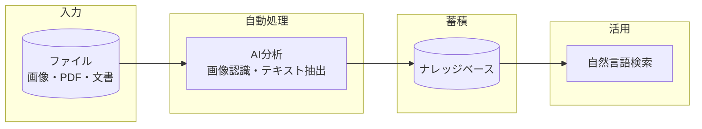
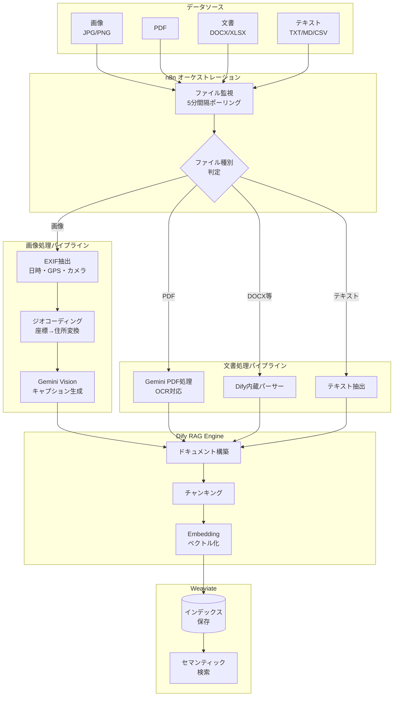
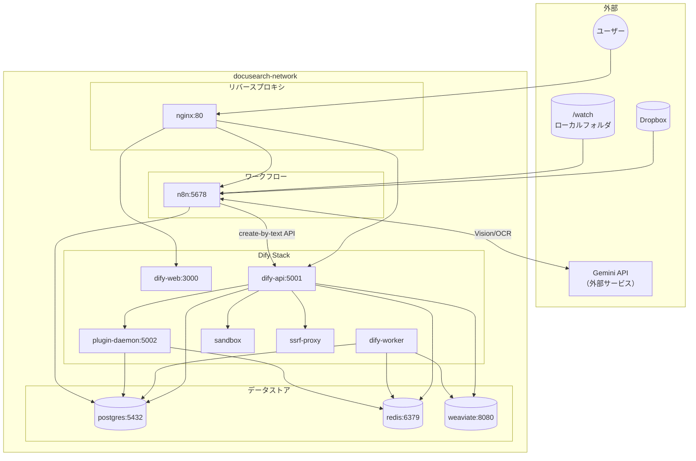
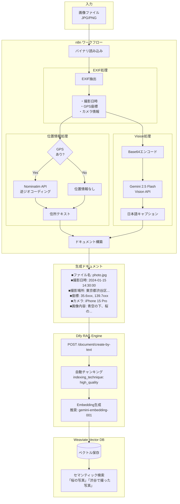
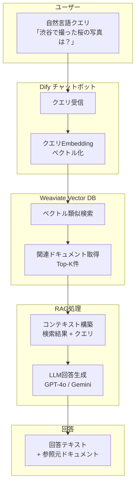
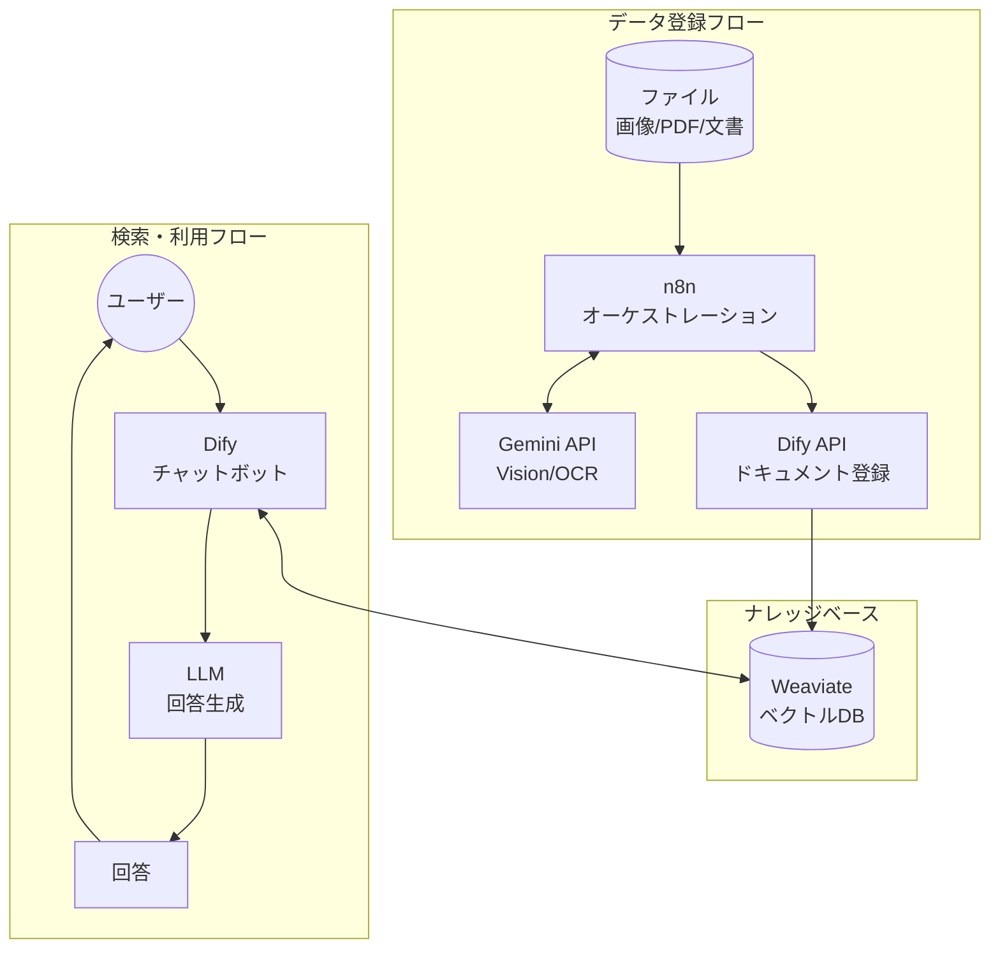

# 01_System_Architecture.md

## システム概要
本システムは、非構造化データ（ドキュメント、画像）を構造化データ（ベクトル、メタデータ）へ変換し、自然言語による高度な検索を実現するRAG（Retrieval-Augmented Generation）プラットフォームである。

---

## アーキテクチャ図

### 図1: システム概要図（経営層・非技術者向け）

シンプルな4ステップで、システムが何をするかを一目で理解できる図。

### 図2: データフロー図（技術概要）

ファイル種別ごとの処理パイプラインを示す図。

### 図3: コンポーネント詳細図（開発者向け）

Dockerコンテナ構成とポート、依存関係を示す図。

### 図4: 画像処理詳細フロー（開発者向け）

画像がどのように処理されてベクトルDBに格納されるかの詳細。

### 図5: 検索・利用フロー（ユーザー視点）

ユーザーが自然言語で検索し、回答を得るまでの流れ。

### 図6: システム全体フロー（登録と検索の統合図）

データ登録フローと検索フローの両方を1つの図で表現。

---

## コア・コンポーネント

### 1. オーケストレーション層 (Automation)
* **Engine:** n8n (Self-hosted)
* **役割:** 外部データソース（Dropbox等）の監視、データパイプラインの制御、APIの統合。
* **処理フロー:**
    * File Polling / Webhook検知
    * 条件分岐（画像ファイル vs 文書ファイル）
    * Vision APIへのリクエスト送信
    * RAGエンジンへのデータ投入

### 2. 知能処理層 (Cognitive & Processing)
* **RAG Engine:** Dify (Open Source)
* **LLM (Inference):** * Text Generation: OpenAI GPT-4o / Gemini 2.5 Pro
    * Vision Analysis: Gemini 2.5 Flash (コストパフォーマンスと速度重視)
* **Vector Database:** Weaviate / Chroma (Dify内包または外部接続)
* **役割:** 文書のチャンク分割、Embedding（ベクトル化）、セマンティック検索、回答生成。

### 3. データソース層 (Storage)
* **Primary:** Dropbox / OneDrive / SharePoint / Local File Server (SMB)
* **Data Type:** * Document: PDF, DOCX, XLSX, TXT, MD
    * Image: JPG, PNG (Exif情報含む)

## データ処理ロジック

### A. 画像データの構造化プロセス (Image-to-Text)
画像はそのままでは検索性が低いため、以下のプロセスでテキスト情報へ変換する。
1.  **メタデータ抽出:** Exifより「撮影日時」「GPS座標」を取得。
2.  **Geocoding:** GPS座標を「住所テキスト（国・県・市・ランドマーク）」へ変換。
3.  **Vision Captioning:** マルチモーダルAIに対し、以下のプロンプトで描写を生成。
    * *Prompt:* "この画像を詳細に描写せよ。写っている物体、色、状況（食事、会議、工事現場など）、文字情報があればそれも含めてテキスト化せよ。"
4.  **Indexing:** 「ファイル名 + メタデータ + キャプション」を1つのドキュメントとしてDifyへ登録。

### B. 文書データの処理
1.  **テキスト抽出:** Dify標準のパーサーを使用。
2.  **チャンキング:** 意味のまとまりごとに500〜1000トークンで分割。
3.  **Indexing:** ベクトル化してDBへ保存。